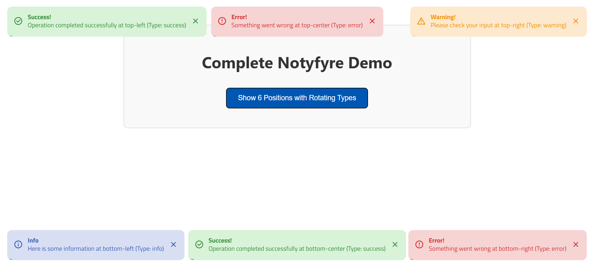

<div align="center">


# 💫 **Rayhan Bapari**
### `Full-Stack Laravel Developer`


</div>

---

## 🌟 **About Me**


```yaml
name: "Rayhan Bapari"
located_in: "Dhaka, Bangladesh 🇧🇩"
current_job: "Full-Stack Laravel Developer"
education: ["Self-Taught", "Continuous Learning"]

fields_of_interests:
  - "Backend Development"
  - "API Development"
  - "Database Design"
  - "System Performance"
  - "Clean Code Practices"

technical_background:
  - "Laravel Ecosystem"
  - "Modern PHP Development"
  - "Frontend Integration"
  - "Database Optimization"

currently_learning: ["Python", "Advanced Laravel Patterns"]
2025_goals: ["Contribute to Open Source", "Master Python", "Build SaaS Products"]
hobbies: ["Problem Solving", "Code Review", "Tech Research"]
```

<br clear="both">

---

## 🛠️ **Technology Arsenal**

<div align="center">
<table>
<tr>
<td align="center" width="25%">

<br><strong>PHP</strong>
</td>
<td align="center" width="25%">

<br><strong>Laravel</strong>
</td>
<td align="center" width="25%">

<br><strong>MySQL</strong>
</td>
<td align="center" width="25%">

<br><strong>Python</strong>
</td>
</tr>

<tr>
<td align="center" width="25%">

<br><strong>JavaScript</strong>
</td>
<td align="center" width="25%">

<br><strong>TypeScript</strong>
</td>
<td align="center" width="25%">

<br><strong>Vue.js</strong>
</td>
<td align="center" width="25%">

<br><strong>HTML5</strong>
</td>
</tr>

<tr>
<td align="center" width="25%">

<br><strong>CSS3</strong>
</td>
<td align="center" width="25%">

<br><strong>TailwindCSS</strong>
</td>
<td align="center" width="25%">

<br><strong>Bootstrap</strong>
</td>
<td align="center" width="25%">

<br><strong>Figma</strong>
</td>
</tr>

<tr>
<td align="center" width="25%">

<br><strong>Git</strong>
</td>
<td align="center" width="25%">

<br><strong>GitHub</strong>
</td>
<td align="center" width="25%">

<br><strong>Firebase</strong>
</td>
<td align="center" width="25%">

<br><strong>VS Code</strong>
</td>
</tr>
</table>
</div>

---

## 📊 **Complete GitHub Analytics**

<div align="center">
### **🏆 GitHub Profile Summary**


### **📊 Detailed Statistics**


### **📊 Detailed Activity Graph**

</div>

---

## 🚀 **Featured Projects**

<div align="center">

<table>
<tr>
<td width="50%">

### 🔔 **Notyfyre**
*Elegant Toast Notification System*



**Tech Stack:** Laravel • JavaScript • CSS

[](https://github.com/rayhan-bapari/Notyfyre)
[](https://packagist.org/packages/rayhan-bapari/notyfyre)


</td>
<td width="50%">

### ⚡ **Vue Notyfyre**
*Toast Notification Library for Vue.js*


**Tech Stack:** Vue.js • TypeScript • CSS

[](https://github.com/rayhan-bapari/vue-notyfyre)
[](https://www.npmjs.com/package/vue-notyfyre)


</td>
</tr>
</table>

---

### 🚀 **More Projects Coming Soon**
*Currently working on exciting new projects*


**Upcoming Open Source Projects:**
- Icon Library For Laravel
- bKash Payment Gateway for Laravel

[](https://github.com/rayhan-bapari?tab=repositories)

</div>

---

## 🌐 **Connect & Collaborate**

<div align="center">


**Let's build something amazing together!**


<br><br>

[](https://github.com/rayhan-bapari)
[](https://linkedin.com/in/md-rayhan-bapari)
[](https://www.hackerrank.com/md_rayhan_bapari)
[](mailto:mdrayhanbapari02@gmail.com)

<br>

### 📧 **Professional Contact**
📍 **Location:** Dhaka, Bangladesh
📧 **Email:** mdrayhanbapari02@gmail.com
💼 **Status:** Available for freelance & full-time opportunities
🌟 **Expertise:** Laravel Development

<br>


</div>

---

<div align="center">


### 💡 *"Code is like humor. When you have to explain it, it's bad."* — Cory House

**🌟 If you found value in my work, consider starring my repositories! 🌟**


</div>
